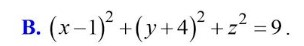
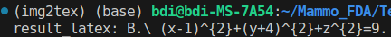

# MathTexViOCR
This repository contains the code of the MathtexViOCR model. The model is fine-tuned from the pix2tex model on the Vietnamese mathematics data set. The dataset includes 200k images for training and 5000 images for testing. The images in the dataset contain mathematical equations collected from Vietnamese exam questions. The model achieved 84% accuracy on the test set.




# Install
```bash
pip install -r requirements.txt
```
# Features

## Training mode
1. Make file dataset.pkl
```bash
python -m img2tex.dataset.dataset -i <path-image1> <path-image2> ... <path-image_n> -e <path-label1.csv> <path-label2.csv> ... <path-label3.csv> -o <path-train.pkl>
```
2. Training
```bash
python -m img2tex.train --config /model/settings/config.yaml
```
3. Evaluation
```bash
python -m img2tex.eval -c <checkpoint_path.pth> -d <eval-data.pkl>
```
## Export model to ONNX format
Repository provides code to export model to onnx format. The export process creates two onnx files, encoder.onnx and decoder.onnx

! The ResnetV2 model's StdConv2dSame class has a pad_same function that contains some logic that causes the export of the onnx model to fail. To export the onnx model correctly, edit the file timms/models/layers/paddings.py with the code in file file_padding_fix.py

1. Export encoder
```bash
python -m img2tex.convert_onnx_encoder
```
2. Export decoder
```bash
python -m img2tex.convert_onnx_decoder
```
3. Infer model onnx
```bash
python -m img2tex.inference_model_onnx
```
## Served model
```bash
cd LatexOCR_triton
```
Expected folder layout
```bash
model_repository/
├── encoder
│   ├── 1
│   │   └── model.onnx
│   └── config.pbtxt
├── decoder
│   ├── 1
│   │   └── model.onnx
│   └── config.pbtxt
├── pipeline
│   ├── 1
│   │   └── model.py
│   └── config.pbtxt

```
Lauch triton server

```bash
docker run --gpus=all -it --rm --shm-size=256m --rm -p8000:8000 -p8001:8001 -p8002:8002 -v $(pwd)/model_repository:/models -v $(pwd):/workspace nvcr.io/nvidia/tritonserver:<24.01>-py3 

```
This will spin up the server and model instances will be ready for inference.

```bash
I0305 07:26:51.177277 133 server.cc:676] 
+----------+---------+--------+
| Model    | Version | Status |
+----------+---------+--------+
| decoder  | 1       | READY  |
| encoder  | 1       | READY  |
| pipeline | 1       | READY  |
+----------+---------+--------+

I0305 07:26:51.240594 133 metrics.cc:877] Collecting metrics for GPU 0: NVIDIA GeForce RTX 2080 Ti
I0305 07:26:51.242804 133 metrics.cc:770] Collecting CPU metrics
I0305 07:26:51.243026 133 tritonserver.cc:2498] 
+----------------------------------+--------------------------------------------------------------------------------------------------------------------------+
| Option                           | Value                                                                                                                    |
+----------------------------------+--------------------------------------------------------------------------------------------------------------------------+
| server_id                        | triton                                                                                                                   |
| server_version                   | 2.42.0                                                                                                                   |
| server_extensions                | classification sequence model_repository model_repository(unload_dependents) schedule_policy model_configuration system_ |
|                                  | shared_memory cuda_shared_memory binary_tensor_data parameters statistics trace logging                                  |
| model_repository_path[0]         | /models                                                                                                                  |
| model_control_mode               | MODE_NONE                                                                                                                |
| strict_model_config              | 0                                                                                                                        |
| rate_limit                       | OFF                                                                                                                      |
| pinned_memory_pool_byte_size     | 268435456                                                                                                                |
| cuda_memory_pool_byte_size{0}    | 67108864                                                                                                                 |
| min_supported_compute_capability | 6.0                                                                                                                      |
| strict_readiness                 | 1                                                                                                                        |
| exit_timeout                     | 30                                                                                                                       |
| cache_enabled                    | 0                                                                                                                        |
+----------------------------------+--------------------------------------------------------------------------------------------------------------------------+

I0305 07:26:51.260660 133 grpc_server.cc:2519] Started GRPCInferenceService at 0.0.0.0:8001
I0305 07:26:51.260941 133 http_server.cc:4623] Started HTTPService at 0.0.0.0:8000
I0305 07:26:51.302973 133 http_server.cc:315] Started Metrics Service at 0.0.0.0:8002
```

Call API for inference model
```bash
python client_pipeline.py
```

